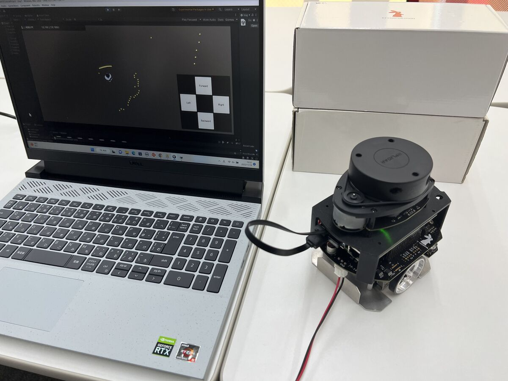

# UnityとROS 2で学ぶ移動ロボット入門 UI作成編



本教材はUnityとROS 2を組み合わせたロボット開発のための入門用教材です。

## 1. はじめるための準備

### 1-1. 必要なもの

* 小型移動プラットフォームロボット「[Raspberry Pi Mouse](https://rt-net.jp/products/raspberrypimousev3/)」
  * ROS 2のサンプルプログラムを実行できるようにセットアップ済みであること
    * Raspberry Pi Mouseのセットアップ方法については[Software Tutorials](https://rt-net.github.io/tutorials/raspimouse/products.html)をご覧ください
  * LiDARと[マルチLiDARマウント](https://www.rt-shop.jp/index.php?main_page=product_info&products_id=3867)
    * [組み立てマニュアル](https://rt-net.jp/wp-content/uploads/2020/04/RaspberryPiMouseOptionKitManual_No08.pdf)に従って組み立ててください
    * LiDARはRPLiDAR A1を推奨、その他のLiDARを使用する場合は適宜読み替えてください
  * Webカメラと[Webカメラマウント](https://www.rt-shop.jp/index.php?main_page=product_info&products_id=3584)
    * [組み立てマニュアル](https://rt-net.jp/wp-content/uploads/2020/04/RaspberryPiMouseOptionKitManual_No04.pdf)に従って組み立ててください
    * マルチLiDARマウントとWebカメラマウントを両方取り付けるためにはM3x14mmのネジが2個必要です
* ノートパソコン等のPC
  * OSはWindowsを想定
  * Unityが起動すること
  * Raspberry Pi Mouseと同じネットワークに接続してあること

### 1-2. GitHubからファイル一式を取得する

本教材は、[Git](https://git-scm.com/) を使用してお手元の環境（PC）に複製してお使いください。

* Gitを使うのが初めての方は、「Git Windows 使い方」 などのキーワードでネット検索すると多くの情報が得られますので参考にしてみてください。

Gitがインストールできたら、Git Bash、コマンドプロンプト または Power Shell などから以下のコマンドを実行します。

GitHub からファイル一式を複製(clone)します。

```
git clone https://github.com/rt-net/Unity-ROS2-MobileRobot-Tutorial.git
```

### 1-3. Raspberry Pi Mouseのセットアップ
[Software Tutorials](https://rt-net.github.io/tutorials/raspimouse/products.html)を参考にして、
Raspberry Pi Mouse上でROS 2のサンプルプログラムを動かせるようにセットアップしてください。

* 注意 : Raspberry Pi Mouseを扱う前に、必ず[製品マニュアル](https://rt-net.jp/products/raspberrypimousev3/#downloads)を参照してください

動作確認済みのROS 2のバージョンは以下の通りです。

* ROS 2 Foxy Fitzroy
* ROS 2 Humble Hawksbill

セットアップの手順は以下のとおりです。

1. [OSとデバイスドライバのインストール](https://rt-net.github.io/tutorials/raspimouse/driver/install.html)
2. [ROS 2のインストール](https://rt-net.github.io/tutorials/raspimouse/ros/install.html)
3. [サンプルパッケージのインストール](https://rt-net.github.io/tutorials/raspimouse/ros/package-install.html)

## 2. 次のステップへ

次は [docs/intro0.md](docs/intro0.md) にお進みください。

## 3. ライセンスについて

Copyright 2022-2023 RT Corporation

本教材は [Apache License 2.0](./LICENSE) です。

サードパーティ製ソフトウェアについては [OSSライセンスに基づく表記](./THIRD-PARTY-NOTICES.md) を参照してください。
