# 付録

## 概要

STEP1～9では扱わなかった内容についても紹介します。

## 動作確認済環境

* Windows 11 Pro バージョン 22H2
* Unity 2021.3.4f1
* [Unity-Technologies/ROS-TCP-Connector](https://github.com/Unity-Technologies/ROS-TCP-Connector) v0.7.0
* [Unity-Technologies/URDF-Importer](https://github.com/Unity-Technologies/URDF-Importer) v0.5.2
* ROS 2 Humble Hawksbill

## 独自のROSメッセージへの対応

[Unity-Technologies/ROS-TCP-Connector](https://github.com/Unity-Technologies/ROS-TCP-Connector)では扱うすべてのROSのメッセージファイルをC#にて定義する必要があります。
[`com.unity.robotics.ros-tcp-connector/Runtime/Messages`](https://github.com/Unity-Technologies/ROS-TCP-Connector/tree/v0.7.0/com.unity.robotics.ros-tcp-connector/Runtime/Messages)から予めUnity用に用意されているROSのメッセージ形式を確認できます。  
使うROSのメッセージがROS-TCP-Connectorに予め含まれていない場合にのみ、C#のスクリプトを用意する必要があります。

### 1. ROSのメッセージファイルを用意

変換したいROSのメッセージファイルを用意します。  
例えばRaspberry Pi Mouse実機に搭載されているLEDの点灯・消灯状態は`LedValues.msg`というメッセージファイルにて定義されている形式で管理されます。

https://github.com/rt-net/raspimouse/blob/1.0.0/raspimouse_msgs/msg/LedValues.msg

### 2. ROSのメッセージファイルからC#スクリプト作成

変換にはROS-TCP-Connectorのメッセージ作成機能を用います。

メニューバーから`Robotics` -> `Generate ROS Messages...`を選択します。

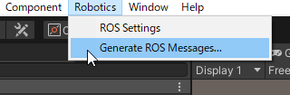

`ROS message path`を指定します。
ROSのメッセージファイルをダウンロードしてきたフォルダを指定します。
`Built message path`には、変換後のC#スクリプトの置き場所を指定します。

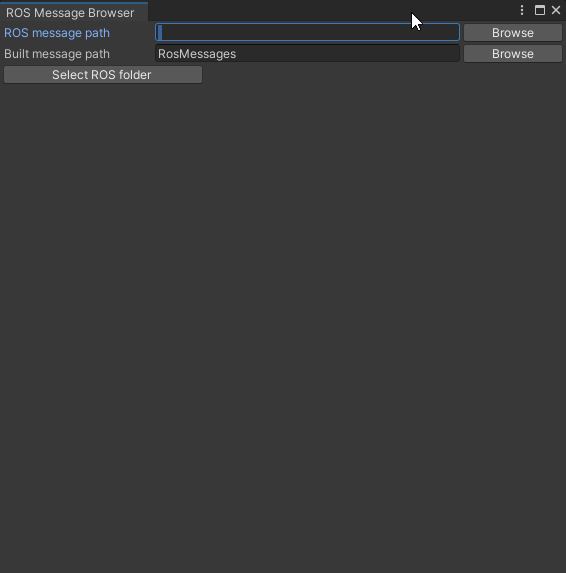

対象の`.msg`ファイルを選択して`Build msg`をクリックします。

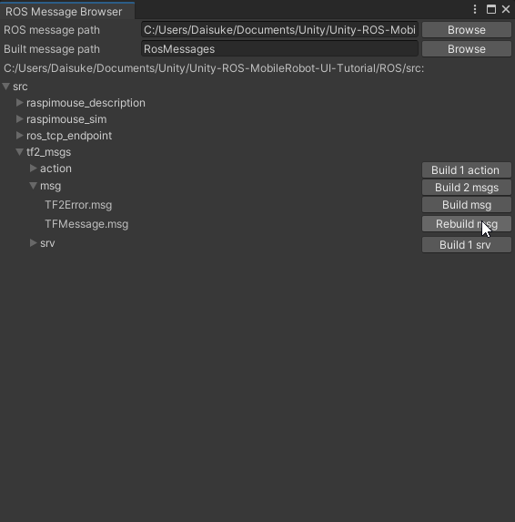

以上でROSのメッセージファイル作成は完了です。Unityプロジェクト内の`Assets/RosMessages`フォルダにC#のスクリプトが作成されています。

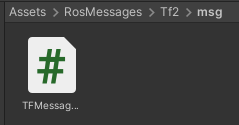

## ロボットのハードウェアモデルの差し替え

STEP1～7ではRaspberry Pi Mouseのハードウェアモデルを使用してきましたが、
他のロボットのハードウェアモデルに差し替えることも可能です。
ここではRaspberry Pi Catのハードウェアモデルを例にして、
使用するハードウェアモデルを実際に差し替えてみます。
基本的には[STEP1](./step1.md)の方法を参考にすれば差し替えが可能なので、
何か分からないことがあれば、[STEP1](./step1.md)を参考にしてみてください。

### 1. URDFモデルの入手

まず、差し替えたいハードウェアモデルを入手します。
今回はRaspberry Pi CatのURDFモデルを使用するので、
[rt-net/raspicat_description](https://github.com/rt-net/raspicat_description)をダウンロードします。

次に、ダウンロードした`raspicat_description`フォルダをUnityプロジェクト内の`Assets/URDF`へインポートします。
インポートができたら、`raspicat_description/urdf/raspicat.urdf`を`Assets/URDF`へコピーします。

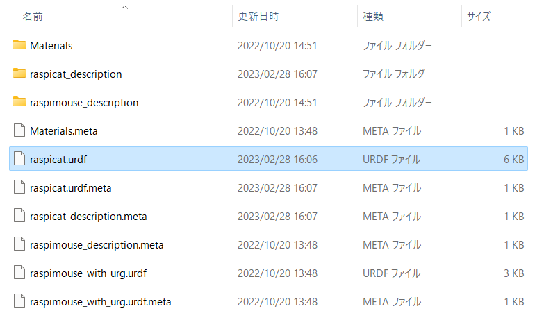

ここまででURDFの準備は完了です。

### 2. URDFモデルをUnityで読み込む

URDFモデルをUnityで読み込みます。

まず、`Assets/URDF`内の`raspicat.urdf`を右クリックして`Import Robot from Selected URDF file`をクリックします。

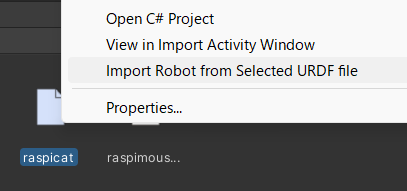

その後`URDF Import Settings`パネルでAxis Typeを`Y axis`に、Mesh Decomposerを`VHACD`で`Import URDF`をクリックします。

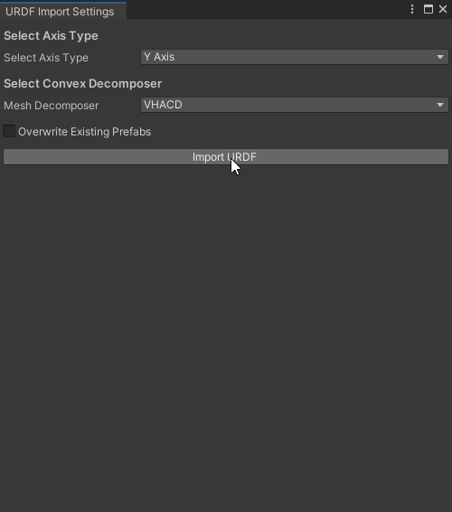

エラーなくインポートできればSceneビューにRaspberry Pi Catが出現しているはずです。

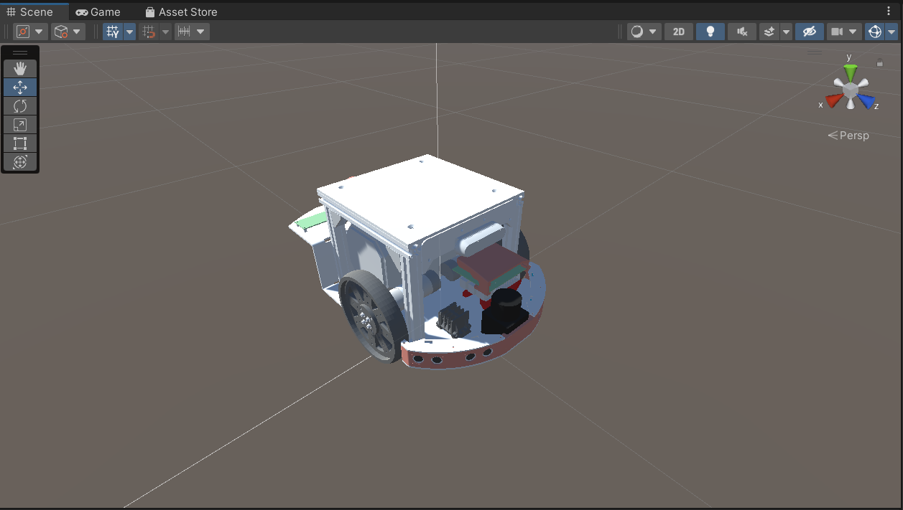

URDF-Importerで読み込んだロボットモデルはUnity上で物理シミュレーションができるように
[Articulation Body](https://docs.unity3d.com/Manual/class-ArticulationBody.html)が適用されます。
しかし、今回はUnityを物理シミュレーションではなくUI開発に使用するので、以下のGameObjectのArticulation Bodyを無効にします。

* `base_link`
* `imu_link`
* `camera_link`
* `camera_depth_frame`
* `camera_depth_optical_frame`
* `camera_color_frame`
* `camera_color_optical_frame`
* `left_side_usensor_link`
* `left_front_usensor_link`
* `right_front_usensor_link`
* `right_side_usensor_link`
* `urg_mount_link`
* `lidar_link`
* `caster_link`
* `caster_wheel_link`
* `left_wheel_link`
* `right_wheel_link`

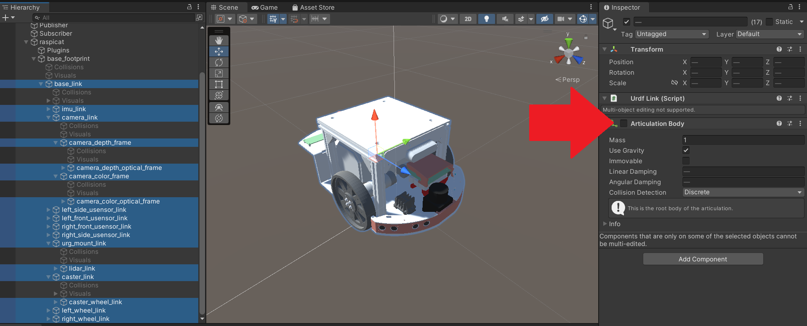

さらに`raspicat`GameObjectにアタッチされている`Controller`スクリプトを無効にしておきます。

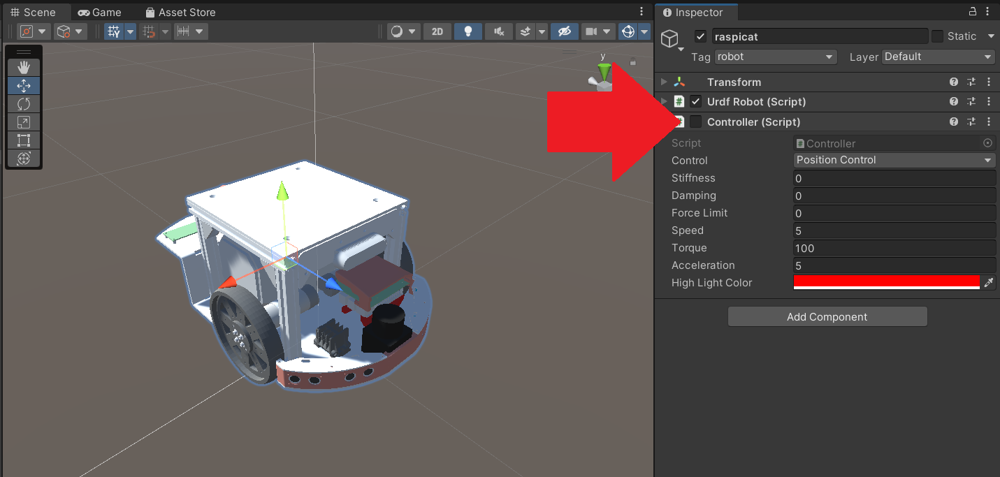

以上でURDFのインポートは完了です。

### 3. ハードウェアモデルの動作確認

各ロボットに合わせて、ROS 2のPublisherやSubscriberを適切に実装して動作確認を行います。
Raspberry Pi Catの場合は次のアニメーションのように動かすことができます。

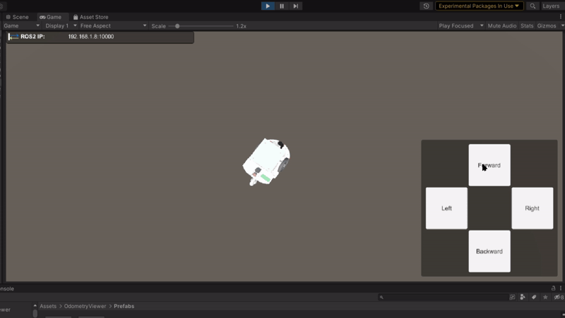