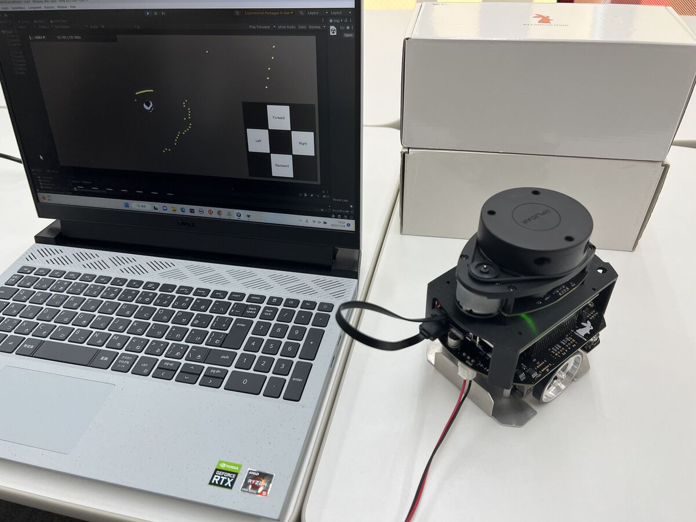

# 本教材で学べること

本教材はUnityとROS 2を組み合わせたロボット開発のための入門用教材です。

Unityを用いてロボット操作用のUIを作成し、
ROS 2で制御された実機の移動ロボットを動かします。

使用するロボットはROS 2対応の小型移動プラットフォームロボット「Raspberry Pi Mouse」です。

使用するPCのOSはWindowsを想定していますが、
環境に合わせて適宜読み替えていただければmacOSやUbuntuでも実行可能です。

## 扱う内容

本教材で扱う内容は以下の通りです。

* ROS 2による移動ロボットの制御
* ロボットモデルの表示
* ロボット操作用ボタンの作成と速度指令値の送信
* ロボット位置姿勢の可視化
* オドメトリの可視化
* LiDARデータの可視化
* カメラ映像の可視化
* JoyStickアセットによる操作
* スキャンした3Dモデルの表示
* SLAMによる地図生成とナビゲーション

使用するロボットのハードウェアやROS 2などのツールについて詳細な解説は省いています。

特にソフトウェアのインストール手順などは頻繁に変更が生じるため、適宜外部のドキュメントへのリンクを案内しています。

## 扱わない内容
本教材はUnityとROS 2との通信とUI開発に特化しており、Unityによる物理演算や距離計測などのシミュレーションは行っていません。

Unityでシミュレータ環境を構築する際はぜひ
[Unity Robotics Hub](https://github.com/Unity-Technologies/Unity-Robotics-Hub)
をご覧ください。

## 想定している対象者

本教材の対象として以下の方を想定しています。

* Unityの開発経験がありロボット制御に興味のある方
* ROS 2の開発経験がありUnityを使ったUI開発に興味のある方
* Unity、ROS 2の開発経験がなくロボットのUI開発に興味のある方

UnityとROS 2が連携したシステムを開発するためには両方の知識が必要になりますが、
連携部分をサンプルプログラムとして用意したので入門者でも扱いやすい内容となっています。
サンプルに含まれていないデータのやり取りをしたい場合も、多くの場合はサンプルを少し書き換えることで対応可能です。
本教材で学んだ後は、ぜひオリジナルのUI作成に挑戦してみて下さい。

## ROS 2のビジュアライズツールとの違い

ROS 2対応しているロボットのUI開発において
RVizなどが広く用いられていますが、
本教材ではこれらをUnityにおきかえることで高精細なグラフィックや
多様なインターフェースを実現することが出来ます。

こうしたUnityの特徴は現実で動作するロボットの状態を端末から確認するといった
いわゆるデジタルツイン分野においても非常に有効です。

[INTRO1](./intro1.md)ではROS 2とUnityが連携することの利点として
Unityの強みを少し掘り下げてご紹介します。

---

* [目次](./intro2.md)
* \> [INTRO1](./intro1.md)