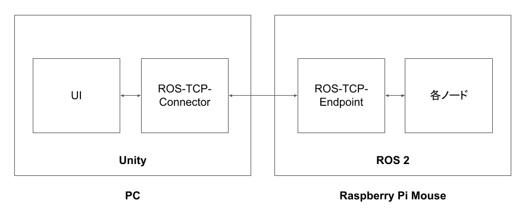
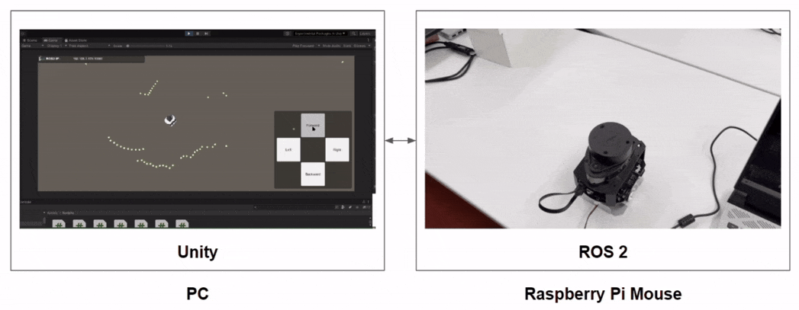
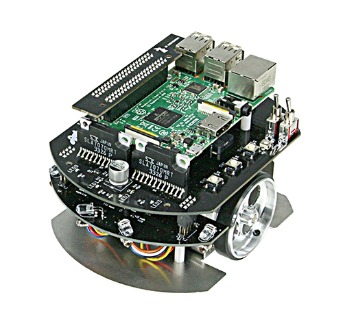

# 教材の構成

## 目次

* [本教材でできること](./intro0.md)
* [Unityとロボットが連携することの利点](./intro1.md)
* [教材の構成](./intro2.md)
* [Raspberry Pi Mouseのセットアップ](./intro3.md)
* [Unityのセットアップ](./step0.md)
* [Raspberry Pi Mouseのハードウェアモデルデータの読み込み](./step1.md)
* [ロボット操作用ボタンの作成とUnityからロボットへ速度指令を送信](./step2.md)
* [Raspberry Pi Mouse位置姿勢の可視化](./step3.md)
* [オドメトリの可視化](./step4.md)
* [LiDARデータの可視化](./step5.md)
* [カメラデータの可視化](./step6.md)
* [JoyStickアセットによる操作](./step7.md)
* [スキャンした3Dモデルの表示](./step8.md)
* [SLAMによる地図生成とナビゲーション](./step9.md)

## ドキュメント

本教材は導入部と本編に分かれています。
導入部では本教材が目的としている
ROS 2対応移動ロボットの操作用UIをUnity上で作成する方法を紹介するにあたり、
必要となる事前知識や関連情報を紹介しています。
本編では実際にロボットを動かす方法やUIの作成を図付きで説明しています。

本編は順番に読んでいただくことを推奨しますが、
導入部は必要に応じて読み飛ばしたり戻って確認するような読み進め方を推奨します。

なお、本教材ではUnityとROS 2対応移動ロボットの接続およびUI作成にフォーカスしているため、
ROS 2のコマンドやその仕組み、Unityのインターフェース名称についてなどは詳しくは説明しません。
これらについて体系的に学びたい場合はROS 2やUnityのチュートリアルを参照してください。

* ROS 2のチュートリアル紹介
    * https://docs.google.com/presentation/d/1BZU3nFDiSrUU7wAMpqgY4kU6-65wxzvfHVRZigsHlDI/edit#slide=id.p
* Unityのチュートリアル
    * https://learn.unity.com/course/unity-tutorials-for-beginners-jp

## 使用環境

本教材ではPC一台と、ROS 2対応の小型移動プラットフォームロボット「Raspberry Pi Mouse」を使用して、
Unity上でロボットの操作用UIを作成する方法を紹介します。
今回はPCのOSはWindowsを想定していますが、適宜読み替えればmacOSやUbuntuでも動くはずです。

### 動作イメージ

### PC

UIの開発や動作確認、環境構築に使用します。

ディスプレイ、マウス、キーボードが搭載されたものを使用してください。OSはWindowsを想定しています。

### [Unity](https://unity.com/ja)

ロボットの操作やセンサ情報の可視化などUIを作成するために使用します。

リアルタイム3Dプラットフォームとよばれ、リアルタイムな3DCGのレンダリングやゲームコントローラなど周辺機器との連携に優れています。ゲーム開発に広く用いられており、映像制作や研究開発、建築、製造分野などで幅広く使用されています。

### [ROS 2](https://www.ros.org/)

ロボットの制御やUnityとの通信に使用します。

ロボットが扱う様々なセンサ値や指令値を並行して処理するなど、ロボット開発において便利な機能がまとまったミドルウェアです。機能ごとにコードをパッケージとしてまとめることができ、作成したパッケージを他のロボットに比較的容易に流用することができます。特に移動ロボットやアームロボット向けのパッケージが多数公開されているため、基本的な機能を流用しながらオリジナリティのある部分に注力することができます。

### [Raspberry Pi Mouse](https://rt-net.jp/products/raspberrypimousev3/) (株式会社アールティ製)

本教材で作成したUIで操作するロボットです。

メインボードに[Raspberry Pi](https://www.raspberrypi.org/)を使った左右独立二輪方式の小型移動プラットフォームロボットです。ROS 2対応ロボットであり、オープンソースでROS 2のサンプルプログラムも多数公開しています。

---

* [目次](./intro2.md)
* < [INTRO1](./intro1.md)
* \> [INTRO3](./intro3.md)
