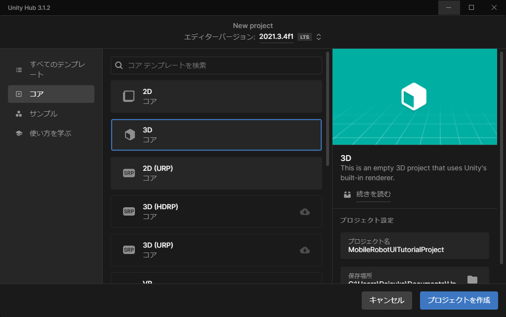
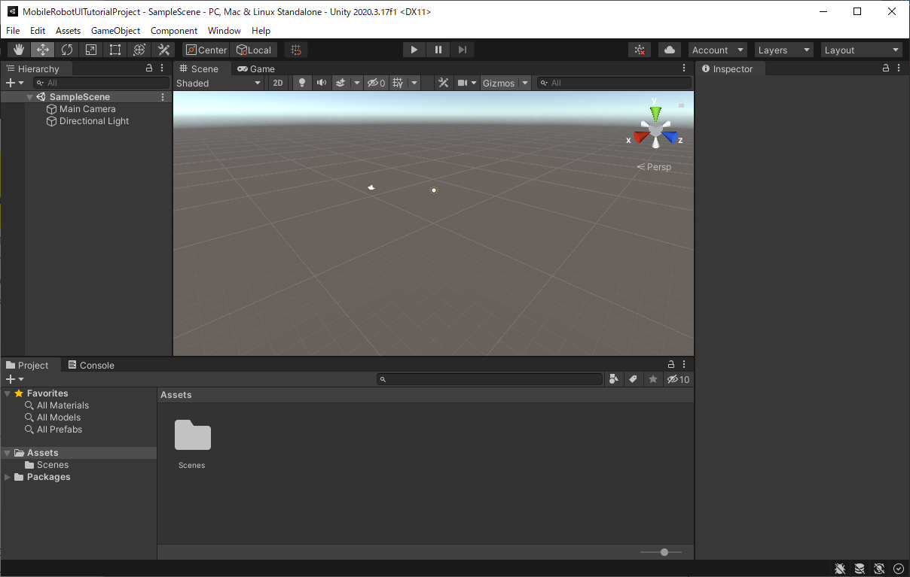

# Unityのセットアップ

## 概要

Unityプロジェクトの作成方法について紹介します。

## 動作確認済環境

* Windows
  * Windows 10 Home バージョン 21H2
  * Windows 11 Pro バージョン 22H2
* Unity
  * Unity 2021.3.4f1
  * Unity 2022.3.8f1

## Unityプロジェクトの作成

今回はLTS版の使用を推奨します。過去のバージョンについては[Unity ダウンロード アーカイブ](https://unity3d.com/jp/get-unity/download/archive)から取得できます。

3Dテンプレートを指定してプロジェクトを作成します。ここではプロジェクト名を「MobileRobotUITutorialProject」など他のプロジェクトと区別できる名称をつけておきます。

何も表示されていないSceneが起動すればUnityプロジェクトの作成は完了です。

## 本STEPのまとめ

Unityプロジェクトの作成方法について紹介しました。

次は[STEP1](./step1.md)に進み、今回作成したUnityプロジェクトにRaspberry Pi Mouseのハードウェアモデルデータを読み込みます。

---

* [目次](./intro2.md)
* < [INTRO3](./intro3.md)
* \> [STEP1](./step1.md)