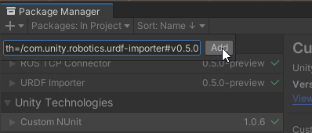
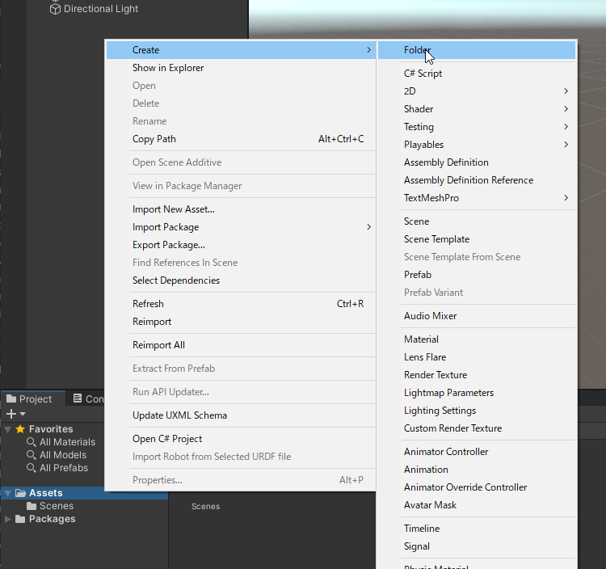
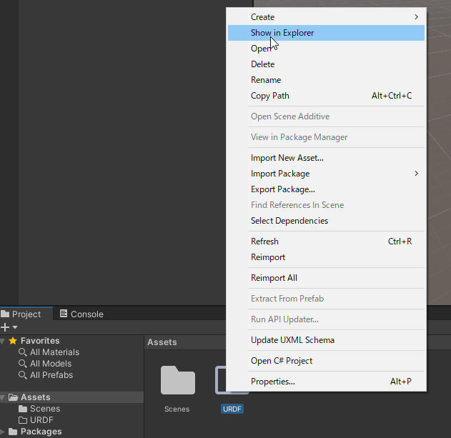
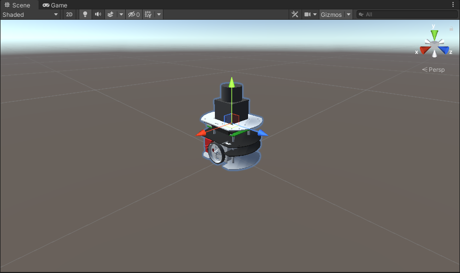
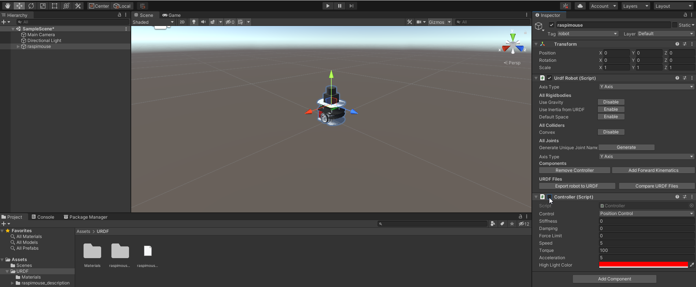

# Raspberry Pi Mouseのハードウェアモデルデータの読み込み

## 概要

Raspberry Pi Mouseのハードウェアモデルデータ（URDFモデル）をUnityにインポートします。

インポートには[Unity-Technologies/URDF-Importer](https://github.com/Unity-Technologies/URDF-Importer)を用います。

Unityプロジェクトの新規作成までの手順は[STEP0](./step0.md)をご参照ください。
本ステップ実行後の状態のSceneファイルは[`MobileRobotUITutorialProject/Assets/Scenes/Step1.unity`](../MobileRobotUITutorialProject/Assets/Scenes/Step1.unity)から入手できます。

## 動作確認済環境

* Windows
  * Windows 10 Home バージョン 21H2
  * Windows 11 Pro バージョン 22H2
* Unity
  * Unity 2021.3.4f1
  * Unity 2022.3.8f1
* [Unity-Technologies/URDF-Importer](https://github.com/Unity-Technologies/URDF-Importer) v0.5.2

## 手順

### 1. パッケージマネージャからURDF-Importerをインストール

パッケージマネージャからURDF-Importerをインストールします。パッケージマネージャはメニューバーの`Window -> Package Manager`から開けます。

左上の＋ボタンから`Add package from git URL`をクリックします。

URDF-ImporterのGitリポジトリへのURLを最新のタグを指定して入力し、`Add`をクリックします。2023年9月現在の最新のタグは`v0.5.2`です。
この場合のGitリポジトリへのURLは `https://github.com/Unity-Technologies/URDF-Importer.git?path=/com.unity.robotics.urdf-importer#v0.5.2` となります。  
※今後のバージョンアップによって使い方が変わる可能性があります。本チュートリアルでは「動作確認環境」に記載のバージョンでのみ動作確認をしています。

### 2. URDFモデルを入手

URDFモデルをダウンロードし、Unityプロジェクト内の`Assets/URDF`フォルダへ配置します。
今回はURDFモデルを予め本プロジェクトと一緒にダウンロードしているのでコピーして配置します。

まず、UnityのProjectパネルで、`Assets/URDF`フォルダを作成します。

次に作成した`Assets/URDF`をエクスプローラで開きます。

[`ROS/src/raspimouse_description`](../ROS/src/raspimouse_description)フォルダを`URDF`フォルダへコピーします。
Windowsの場合はCtrlキーを押しながらドラッグすると移動ではなくコピーができます。

次にコピーしてきた`raspimouse_description`フォルダ内の`urdf/raspimouse_with_urg.urdf`を作成した`Assets/URDF`にコピーしておきます。
この配置とすることでURDFモデルをURDF-Importerを使ってインポートする時にモデルデータのパスが解決できるようになります。
（`.meta`ファイルはUnityで自動的に生成されるものなので無視して構いません）

ここまででURDFモデルの準備は完了です。

### 3. URDFモデルをUnityで読み込む

URDFモデルをUnity上で読み込み、次のSTEP以降で必要な設定をしておきます。

まず、`Assets/URDF`内の`raspimouse_with_urg.urdf`を右クリックして`Import Robot from Selected URDF file`をクリックします。

その後`URDF Import Settings`パネルでAxis Typeを`Y axis`に、Mesh Decomposerを`VHACD`で`Import URDF`をクリックします。

エラーなくインポートできればSceneビューにRaspberry Pi Mouseが出現しているはずです。

URDF-Importerで読み込んだロボットモデルはUnity上で物理シミュレーションができるように
[Articulation Body](https://docs.unity3d.com/Manual/class-ArticulationBody.html)が適用されます。
しかし、今回はUnityを物理シミュレーションではなくUI開発に使用するので、以下のGameObjectのArticulation Bodyを無効にします。

* `base_link`
* `right_wheel_link`
* `left_wheel_link`
* `urg_mount_link`
* `lidar_link`

さらに`raspimouse`GameObjectにアタッチされている`Controller`スクリプトを無効にしておきます。

以上でURDFのインポートは完了です。

## 本STEPのまとめ

URDFモデルを準備し、URDF-Importerを使ってUnityのプロジェクトにインポートする方法を紹介しました。
さらにUnityの物理演算を使わない場合のGameObjectの設定についても紹介しました。

今回は同梱しているURDFモデルを使いましたが、他のURDFモデルを使用することもできます。
例えば、Raspberry Pi Mouseと同じくアールティから販売されているJetson Nano Mouseを使おうと思った場合は[rt-net/jnmouse_description](https://github.com/rt-net/jnmouse_description)からデータをダウンロードしてプロジェクトに取り込めばURDF-Importerを使って同じようにロボットを表示させることができるようになります。

また、[付録ページ](./appendix.md)において、Raspberry Pi Mouse以外のURDFモデルを実際に使用する方法を紹介しています。

---

* [目次](./intro2.md)
* < [STEP0](./step0.md)
* \> [STEP2](./step2.md)