# ロボット操作用ボタンの作成とUnityからロボットへ速度指令を送信

## 概要

ロボット操作用ボタンの作成と、Unityからロボットへ速度指令を送信する手順を紹介します。

本ステップ実行後の状態のSceneファイルは[`MobileRobotUITutorialProject/Assets/Scenes/Step2.unity`](../MobileRobotUITutorialProject/Assets/Scenes/Step2.unity)から入手できます。

## 動作確認済環境

* Windows
  * Windows 10 Home バージョン 21H2
  * Windows 11 Pro バージョン 22H2
* Unity
  * Unity 2021.3.4f1
  * Unity 2022.3.8f1
* [Unity-Technologies/ROS-TCP-Connector](https://github.com/Unity-Technologies/ROS-TCP-Connector) v0.7.0
* ROS 2
  * ROS 2 Foxy Fitzroy
  * ROS 2 Humble Hawksbill

## 手順

### 1. パッケージマネージャからROS-TCP-Connectorをインストール

パッケージマネージャからROS-TCP-Connectorをインストールします。パッケージマネージャはメニューバーの`Window -> Package Manager`から開けます。

左上の＋ボタンから`Add package from git URL`をクリックします。

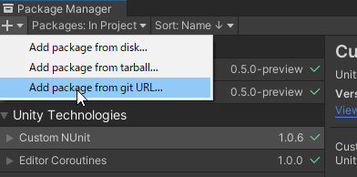

ROS-TCP-ConnectorのGitリポジトリへのURLを最新のタグを指定して入力し、`Add`をクリックします。2023年9月現在の最新のタグは`v0.7.0`です。
この場合のGitリポジトリへのURLは `https://github.com/Unity-Technologies/ROS-TCP-Connector.git?path=/com.unity.robotics.ros-tcp-connector#v0.7.0` となります。  
※今後のバージョンアップによって使い方が変わる可能性があります。本チュートリアルでは「動作確認環境」に記載のバージョンでのみ動作確認をしています。

メニューバーに`Robotics`というメニューが追加されます。メニューバーから`Robotics` -> `ROS Settings`を開き、以下の設定となっていることを確認します。`Protocol`はROS 2を選択します。`ROS IP Address`はRaspberry Pi MouseのIPアドレスを指定します。

* Connect on Startup: True
* Protocol: ROS 2
* ROS IP Address: 192.168.1.89（例）
* ROS Port: 10000
* Show HUD: True

### 2. カメラのアングルを調整

まず、Gameビューを調整するためにカメラのアングルを調整します。

`Main Camera`ビューを確認しながら`Main Camera`の`Position`と`Rotation`を調整します。
以下が参考値です。

* Position
  * X : 1.0
  * Y : 2.1
  * Z : -0.5
* Rotation
  * X : 70
  * Y : -35
  * Z : 0

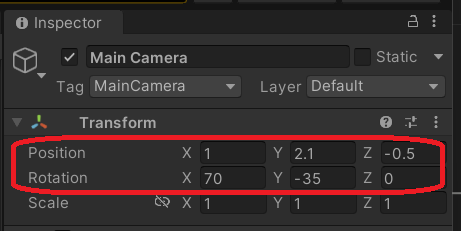

### 3. ロボット操作用ボタンを作成

Hierarchyウィンドウを右クリックして`UI`->`Panel`を選択します。

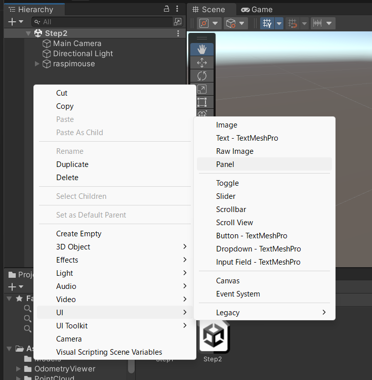

InspectorウィンドウでPanelの位置とサイズを調整します。
PanelはGameウィンドウから確認することができます。

`Rect Transform`コンポーネント左上にある二重の四角をクリックすると
Panel位置を調整するためのAnchor Presetsが開くので右下寄せになるright-bottomを選択します。

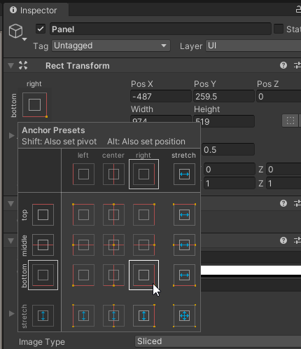

Pos X, Pos Y, Pos Z, Width, Heightはそれぞれ-170, 170, 0, 320, 320にします。

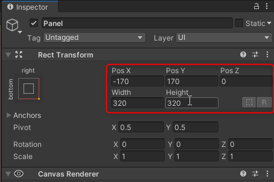

次にHierarchyウィンドウで`Canvas`->`Panel`を右クリックして`UI`->`Button`を選択し、`ButtonForward`と名前をつけます。

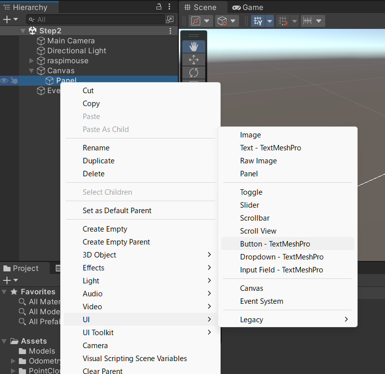
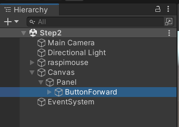

画像のようなウィンドウが表示された場合、TextMesh Proを使用するために、`Import TMP Essentials`をクリックします。

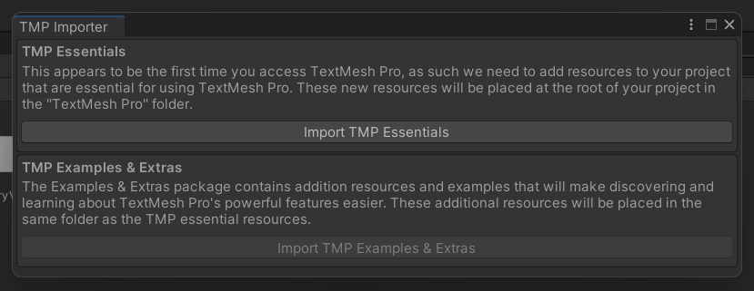

InspectorウィンドウでButtonの位置とサイズを調整します。

Pos X, Pos Y, Pos Z, Width, Heightはそれぞれ0, 100, 0, 100, 100にします。

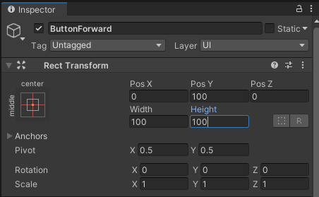

次にHierarchyウィンドウから`ButtonForward`オブジェクトの子の`Text`オブジェクトを選択し、Buttonのラベルを「Forward」に修正します。

* テキストがボタンをはみ出してしまう場合は、テキストのフォントサイズを小さくするなどして対応できます。

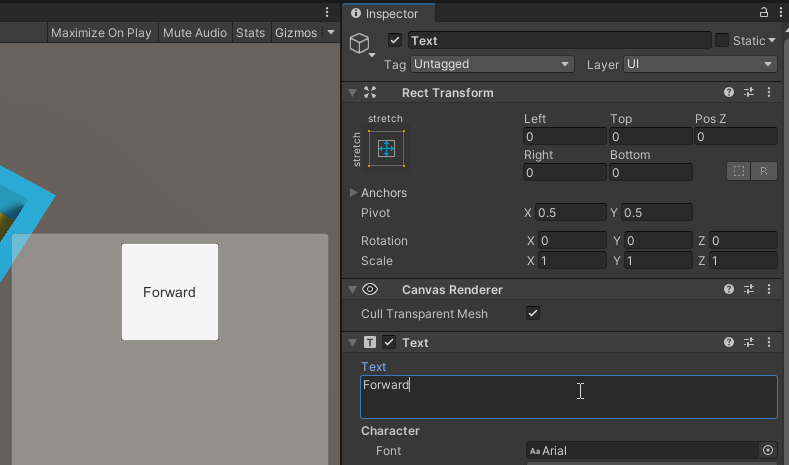

同様にしてBackward, Left, Rightについても作成します。

| Button | Pos X | Pos Y | Pos Z | Width | Height | Text |
| :----- | :---- | :---- | :---- | :---- | :----- | :--- |
| ButtonForward | 0 | 100 | 0 | 100 | 100 | Foraward |
| ButtonBackward | 0 | -100 | 0 | 100 | 100 | Backward |
| ButtonLeft | -100 | 0 | 0 | 100 | 100 | Left |
| ButtonRight | 100 | 0 | 0 | 100 | 100 | Right |

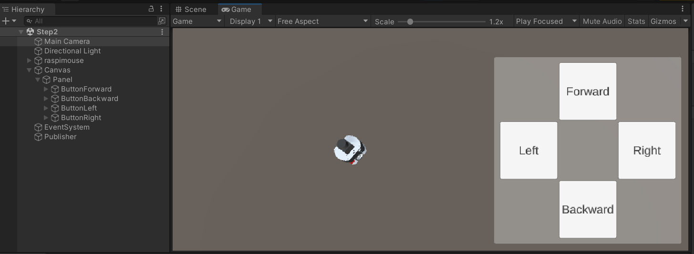

次にHierarchyウィンドウを右クリックして`Create Empty`を選択し、`Publisher`としてGameObjectを作成します。

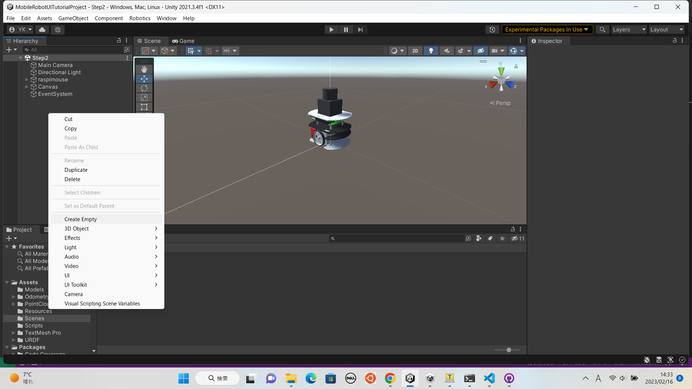
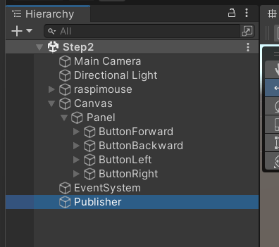

### 4. 操作用ボタンにイベントを登録

次に作成したボタンにイベントを登録します。

[`UnityScripts/Scripts`](../UnityScripts/Scripts)フォルダをUnityプロジェクトの`Assets`フォルダにコピー（`Assets/Scripts`として配置）します。

コピーした`Scripts`フォルダ内の`CmdVelPublisher.cs`を先程作成した`Publisher`オブジェクトにコンポーネントとして追加します。

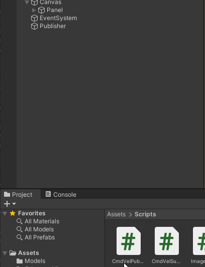

`Publisher`オブジェクトのInspectorウィンドウを確認すると`Cmd Vel Publisher`スクリプトが追加されていることを確認できます。ここの`Linear Vel`が進行方向の基準となる速度、`Angular Vel`が旋回方向の基準となる角速度となっています。今回はそれぞれを`0.5`と`1.5`に設定します。速度の単位はm/s、角速度の単位はrad/sです。

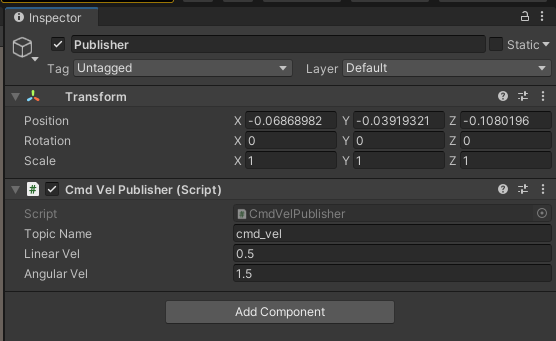

`ButtonForward`オブジェクトのInspectorウィンドウの`Add Component`ボタンから`Event Trigger`コンポーネントを追加します。

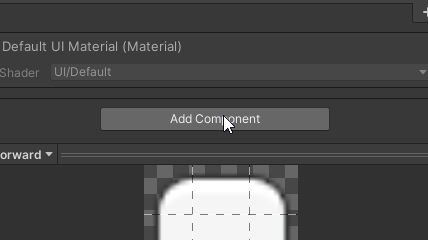

`Add New Event Type`から`Pointer Down`イベントを追加します。

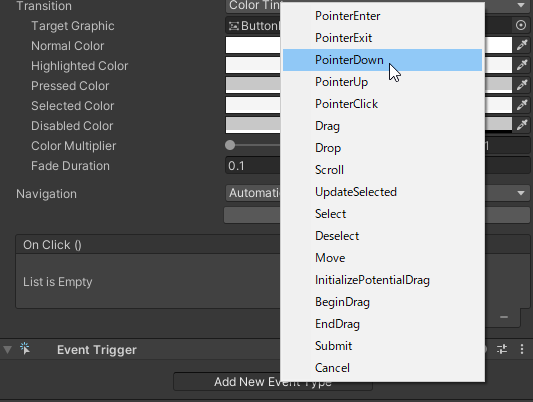

`Pointer Down`イベントのリストを2つに増やし、それぞれに`Publisher`オブジェクトを指定します。

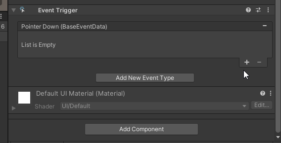

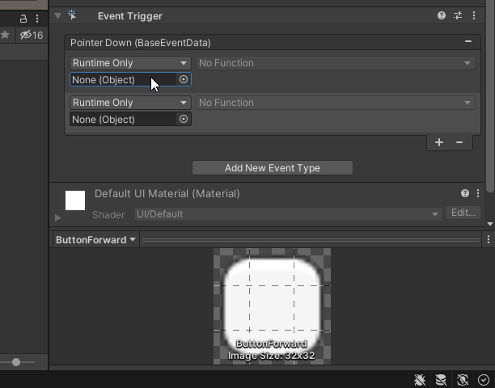

追加した`Pointer Down`イベントに上から順に`CmdVelPublisher.SetForwardVel`ファンクションと`CmdVelPublisher.Publish`ファンクションを指定します。
このとき`CmdVelPublisher.SetForwardVel`ファンクションの引数は`1`を指定します。
この引数が`Publisher`オブジェクトのInspectorウィンドウから確認できる基準速度、基準角速度にかける倍率です。
今回は進行方向の基準速度が`0.5`、倍率が`1.0`なので0.5m/sの移動指令を送信することになります。


同様にして`Pointer Up`イベントに`CmdVelPublisher.SetStopVel`と`CmdVelPublisher.Publish`ファンクションを指定します。
このイベントを登録することでボタンを離したら移動指令を止める（押している間だけ移動指令を出す）ことができるようになります。

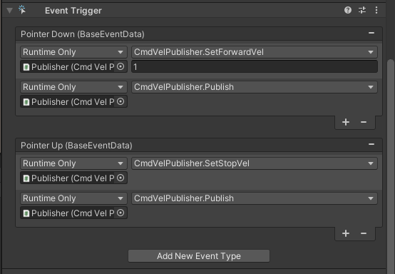

同様にして各ボタンに移動指令を送信のイベントを登録します。

繰り返しでイベントを登録する際にはコンポーネントを使いまわしすると楽です。

`ButtonForward`オブジェクトの`Event Trigger`コンポーネントのオプションから`Copy Component`を選びます。

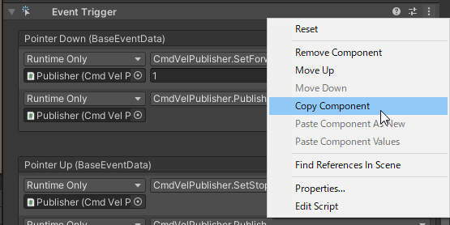

`ButtonBackward`オブジェクトに`Event Trigger`コンポーネントを追加し、オプションから`Paste Component Values`を選びます。

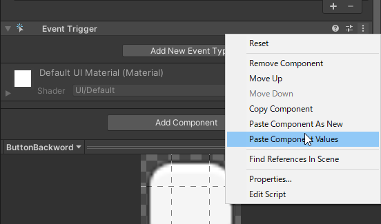

`Pointer Down`イベントの1つ目のファンクションを`CmdVelPublisher.SetBackwardVel`ファンクションに変更します。

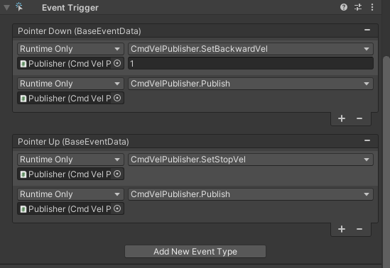

以上で2つ目のボタンへのイベント登録は完了です。

同様にして`ButtonLeft`オブジェクトと`ButtonRight`オブジェクトに`Event Trigger`コンポーネントを追加して設定をコピーし、
それぞれ`CmdVelPublisher.SetLeftTurnVel`と`CmdVelPublisher.SetRightTurnVel`を指定します。

以上で4つのボタンへのイベントの登録が完了です。

### 5. Raspberry Pi Mouseを起動

Raspberry Pi Mouseの電源を入れます。

`Tera Term`などを使用して、PCからRaspberry Pi MouseへSSHで接続します。

以下のコマンドでデバイスドライバのインストールを行います。

```
cd RaspberryPiMouse/utils
./build_install.bash
```

Raspberry Pi MouseのモータのスイッチをONにします。

一つ目の端末で以下のコマンドを順番に実行して、Raspberry Pi Mouseを動かすためのノードを起動します。

```bash
source ~/ros2_ws/install/setup.bash
ros2 launch raspimouse raspimouse.launch.py
```

次に、もうひとつ別にSSHで接続して端末を開き、以下のコマンドを実行して、RPLiDARのノードを起動します。

```bash
# モータをONにする
source ~/ros2_ws/install/setup.bash
ros2 service call /motor_power std_srvs/SetBool '{data: true}'

# RPLiDARのノードを起動
ros2 launch rplidar_ros rplidar.launch.py
```

さらにもうひとつ別にSSHでログインして端末を開き、以下のコマンドを順番に実行して、ウェブカメラのノードを起動します。

```bash
source ~/ros2_ws/install/setup.bash
ros2 run v4l2_camera v4l2_camera_node
```

そして最後に4つめの端末を開いて、以下のコマンドを順番に実行して、Unityと通信するためのノードを起動します。
```ros2 run ros_tcp_endpoint default_server_endpoint --ros-args -p ROS_IP:=192.168.1.89```の```ROS_IP```は、
Raspberry Pi MouseのIPアドレスを指定してください。

```bash
source ~/ros2_ws/install/setup.bash
ros2 run ros_tcp_endpoint default_server_endpoint --ros-args -p ROS_IP:=192.168.1.89
```

[ros_tcp_endpointの起動コマンドに関する参考ページ](https://github.com/Unity-Technologies/Unity-Robotics-Hub/blob/main/tutorials/ros_unity_integration/setup.md)

### 6. 再生モードでUnityプロジェクトを実行

Unityで再生ボタンを押し、再生モードでプロジェクトを実行します。

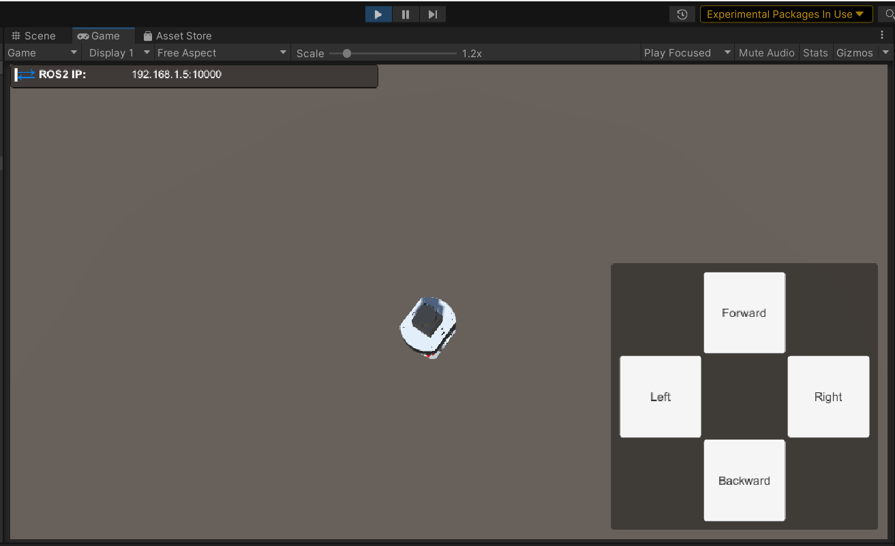

このとき、以下のようなメッセージがUnityのコンソールに出る場合もありますが、無視して問題ありません。  

```
Connection to 127.0.0.1:10000 failed - System.Net.Sockets.SocketException (0x80004005): 対象のコンピューターによって拒否されたため、接続できませんでした。
```

再生モード中の画面表示が小さい場合は、Gameビューの`Low Resolution Aspect Ratios`のチェックを外して下さい。

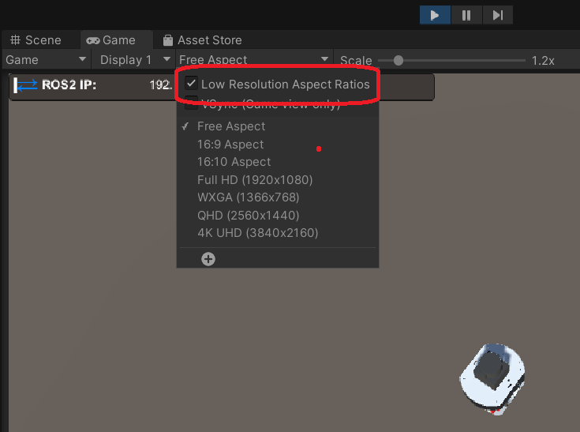

### 7. 操作ボタンから移動指令送信

再生モードのUnityでボタンを操作すると移動指令が送信され、実機のロボットが移動することを確認できます。

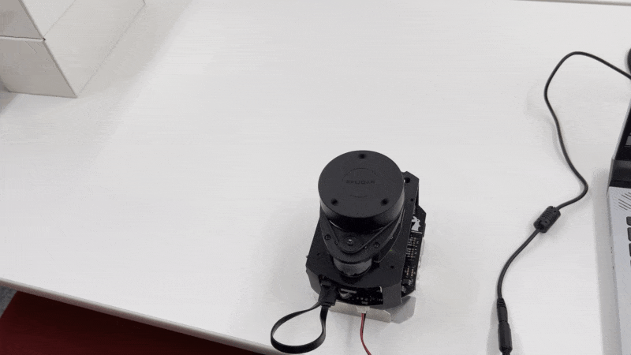

このとき、Unity上のロボットは動きません。
Unity上のロボットも実機のロボットにあわせて動かせるようにする方法は次の[STEP3](./step3.md)にて紹介します。

最後に、動作確認が終わったら全ての端末でCtrl+Cを押してコマンドを終了させます。

## 本STEPのまとめ

ロボット操作用ボタンを作成し、Unityから実機のロボットへ速度指令を送信できるようにする方法を紹介しました。
さらに実機のロボットを動かすまでを紹介しました。

次は[STEP3](./step3.md)で実機のロボットの位置姿勢を可視化（Unity上に反映）する方法を紹介します。

---

* [目次](./intro2.md)
* < [STEP1](./step1.md)
* \> [STEP3](./step3.md)