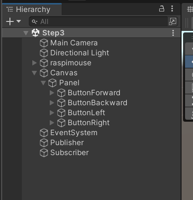

# Raspberry Pi Mouseの位置姿勢の可視化
## 概要

実機のロボットの位置姿勢を取得し、Unity上に反映させる方法を紹介します。

本ステップ実行後の状態のSceneファイルは[`MobileRobotUITutorialProject/Assets/Scenes/Step3.unity`](../MobileRobotUITutorialProject/Assets/Scenes/Step3.unity)から入手できます。

## 動作確認済環境

* Windows
  * Windows 10 Home バージョン 21H2
  * Windows 11 Pro バージョン 22H2
* Unity
  * Unity 2021.3.4f1
  * Unity 2022.3.8f1
* [Unity-Technologies/ROS-TCP-Connector](https://github.com/Unity-Technologies/ROS-TCP-Connector) v0.7.0
* ROS 2
  * ROS 2 Foxy Fitzroy
  * ROS 2 Humble Hawksbill

## 手順

### 1. ROS 2トピックのサブスクライバスクリプトの登録

ROS 2から配信されるトピックを受信するために、サブスクライバをUnityに登録します。

Hierarchyウィンドウを右クリックして`Create Empty`を選択し、`Subscriber`としてGameObjectを作成します。

作成した`Subscriber`オブジェクトに`Assets/Scripts/TfSubscriber.cs`スクリプトをアタッチ（スクリプトをオブジェクトにドラッグ&ドロップ）します。

（`Hierarchy`ウィンドウからGameObjectを選択してInspectorウィンドウ上で任意のスクリプト コンポーネントを追加することも可能です。）

Inspectorウィンドウで`Tf Subscriber`コンポーネントの`Mobile Robot`に`raspimouse`オブジェクトを指定します。

以上でROS 2から配信されるロボットの位置姿勢を受信してUnity上のロボットに反映させる準備ができました。

### 2. Unityプロジェクトの実行

[STEP2](./step2.md)と同様に、

1. 再生モードでUnityプロジェクトを実行
2. Raspberry Pi Mouseでコマンドを実行
3. 操作ボタンから移動指令送信

の手順でロボットを動かしてみます。

Consoleを見ると位置姿勢の受信結果と座標変換のデバッグログを確認できます。
ROS 2とUnityでは座標系が異なるため、この差分を吸収するために`TfSubscriber.cs`スクリプト内で座標変換をしています。
座標変換については次の「位置姿勢の表現方法とROS 2とUnityにおける座標系の違い」を参照してください。

また、動作確認が終わったら全ての端末でCtrl+Cを押してコマンドを終了させます。

## 位置姿勢の表現方法とROS 2とUnityにおける座標系の違い
### 位置の表現方法
ロボットの位置を表現するには原点を基準にした前後、左右、上下方向の距離を用います。例えば下図のように原点から見たロボット位置を前後、左右、上下の順に書くと(4,2,0)と表現できます。このように数値で表現された位置を座標、表現方法の決まりごとを座標系といいます。ちなみに今回用いる座標系は3つの方向がそれぞれ直角に交わっているため直交座標系とよばれています。

### 姿勢の表現方法
ロボットの姿勢はクォータニオンとよばれる形式が用いられます。位置と同じように回転する軸の方向を3つの要素で表現し、回転量をもう1つの要素で表現する方法です。これは人の直感的な認識に沿わないので数値を見ても姿勢を想像することが難しいのですが、コンピュータ上で処理する際にとても便利な形式になっています。クォータニオンの値を人が直接扱うことはあまりないためわからなくても問題ありません。クォータニオンはこのような祭りが開催されるほどステップアップのための重要なテーマになっています。

* [納涼クォータニオン夏祭り | Unity Learning Materials](https://learning.unity3d.jp/5830/)

### UnityとROS 2の座標系の違い
UnityもROS 2もロボット位置にx,y,zの3つ、姿勢の場合はx,y,z,wの4つの変数が割り当てられていますが、それぞれの座標系で変数と方向の対応が異なる点に注意する必要があります。Unity座標系におけるx,y,zはそれぞれ右、上、前方向に対応していますが、ROS 2座標系では前、左、上の順で対応しています。

UnityとROS 2の座標系の変換を変数で表現してみます。Unity座標系における位置(x,y,z)がROS 2座標系では(z,−x,y)、ROS 2座標系における位置(x,y,z)がUnity座標系では(−y,z,x)となります。姿勢も位置と同様にUnity座標系における姿勢(x,y,z,w)がROS 2座標系では(z,-x,y,-w)、ROS 2座標系における姿勢(x,y,z,w)がUnity座標系では(-y,z,x,-w)になります。非常にややこしいのですが変換のコードさえ書いてしまえば毎回考える必要はありません。今回の説明を読んでピンとこない方もUnityとROS 2の間では何かしら変換が必要であることだけを意識していただければ問題ないです。

### 本STEPのまとめ

実機のロボットの位置姿勢をUnity上で表示して可視化する方法とその確認方法を紹介しました。
またUnityとROS 2の座標系の違いについても紹介しました。

次は[STEP4](./step4.md)でロボットのオドメトリを可視化する方法を紹介します。

---

* [目次](./intro2.md)
* < [STEP2](./step2.md)
* \> [STEP4](./step4.md)