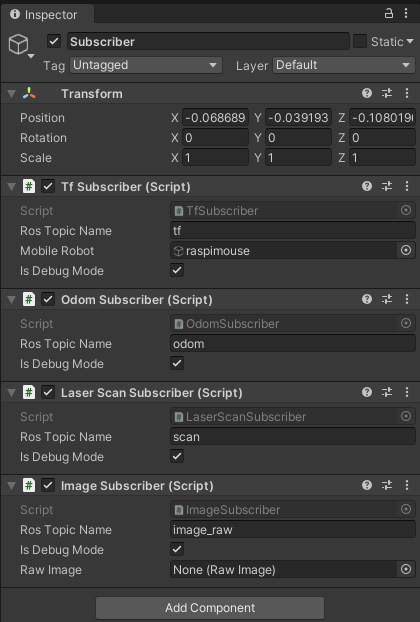
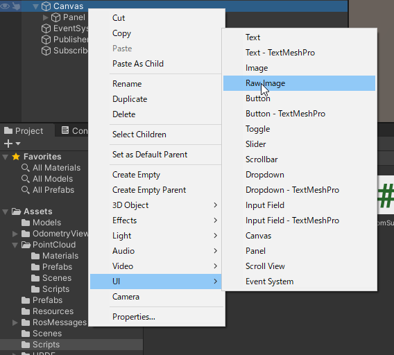
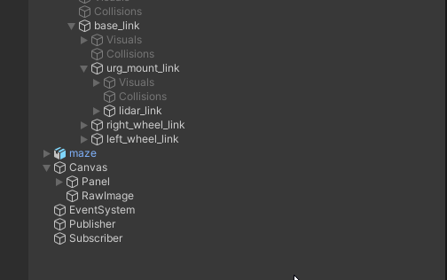
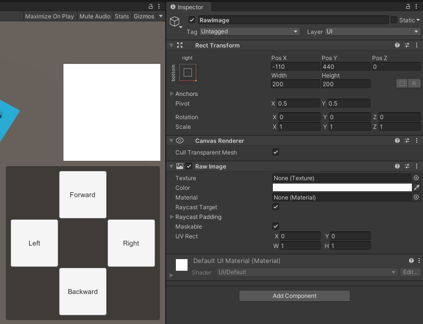
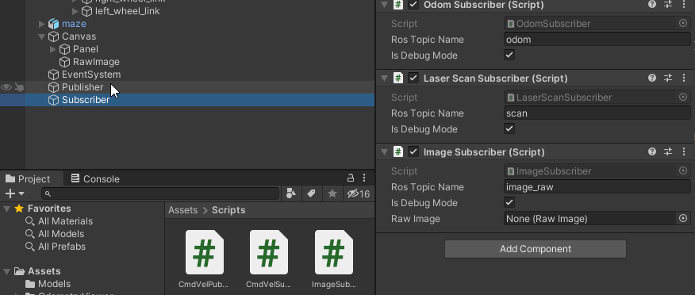
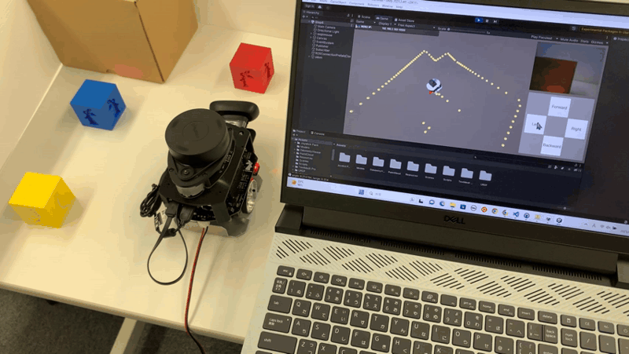

# カメラデータの可視化

## 概要

Raspberry Pi Mouseに搭載したウェブカメラのデータを可視化する方法を紹介します。

本ステップ実行後の状態のSceneファイルは[`MobileRobotUITutorialProject/Assets/Scenes/Step6.unity`](../MobileRobotUITutorialProject/Assets/Scenes/Step6.unity)から入手できます。

## 動作確認済環境

* Windows
  * Windows 10 Home バージョン 21H2
  * Windows 11 Pro バージョン 22H2
* Unity
  * Unity 2021.3.4f1
  * Unity 2022.3.8f1
* [Unity-Technologies/ROS-TCP-Connector](https://github.com/Unity-Technologies/ROS-TCP-Connector) v0.7.0
* ROS 2
  * ROS 2 Foxy Fitzroy
  * ROS 2 Humble Hawksbill

## 手順

## 1. カメラデータ受信用スクリプトをアタッチ

[STEP6](./step6.md)までと同様に`Assets/Scripts/ImageSubscriber.cs`を`Subscriber`オブジェクトにアタッチします。

ここまでで`Subscriber`に追加したコンポーネントは`Tf Subscriber`、`Odom Subscriber`、`Laser Scan Subscriber`、`Image Subscriber`の4つになります。

## 2. カメラデータ描画用GameObjectの作成と描画設定

Hierarchyウィンドウの`Canvas`オブジェクトの子オブジェクトとして`RawImage`形式のGameObjectを`RawImage`という名前で作成します。

`RawImage`オブジェクトについてInspectorウィンドウから表示位置を変更します。
`Rect Transform`コンポーネントのAnchor Presetsは右下寄せになるright-bottomを選択します。
Pos X, Pos Y, Pos Z, Width, Heightはそれぞれ-170, 460, 0, 320, 240にします。

次に、`Subscriber`オブジェクトを選択してInspectorウィンドウを開き、`Image Subscriber`コンポーネントの`Raw Image`に先程作成した`RawImage`オブジェクトをを指定します。

＊`Subscriber`オブジェクトの`Image Subscriber`にて、`ROS Topic Name`が`image_raw/compressed`になっていることを確認してください。

### 3. Unityプロジェクトの実行

[STEP2](./step2.md)と同様に、

1. 再生モードでUnityプロジェクトを実行
2. Raspberry Pi Mouseでコマンドを実行
3. 操作ボタンから移動指令送信

の手順でロボットを動かしてみます。

オドメトリとLiDARデータに加えて、カメラデータを可視化することができました。

最後に、動作確認が終わったら全ての端末でCtrl+Cを押してコマンドを終了させます。

### 本STEPのまとめ

カメラデータ受信用スクリプトとカメラデータ描画用オブジェクトを追加し、カメラデータを可視化する方法を紹介しました。

---

* [目次](./intro2.md)
* < [STEP5](./step5.md)
* \> [STEP7](./step7.md)