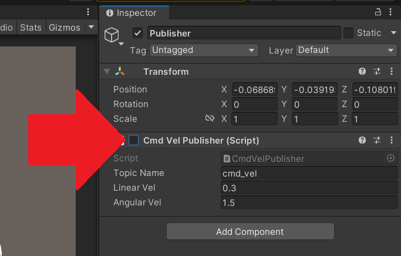

# JoyStickアセットによる操作

## 概要

[Unity Asset Store](https://assetstore.unity.com/)で公開されているJoyStickアセットを利用して、
Raspberry Pi Mouseをより直感的に操作する方法を紹介します。

本ステップ実行後の状態のSceneファイルは[`MobileRobotUITutorialProject/Assets/Scenes/Step7.unity`](../MobileRobotUITutorialProject/Assets/Scenes/Step7.unity)から入手できます。

## 動作確認済環境

* Windows
  * Windows 10 Home バージョン 21H2
  * Windows 11 Pro バージョン 22H2
* Unity
  * Unity 2021.3.4f1
  * Unity 2022.3.8f1
* [Unity-Technologies/ROS-TCP-Connector](https://github.com/Unity-Technologies/ROS-TCP-Connector) v0.7.0
* ROS 2
  * ROS 2 Foxy Fitzroy
  * ROS 2 Humble Hawksbill

## 手順

### 1. JoyStickアセットの入手

[Unity Asset Store](https://assetstore.unity.com/)から、JoyStickアセットである`Joystick Pack`を入手します。

まず、[Unity Asset Store](https://assetstore.unity.com/)にアクセスするために、`Window -> Asset Store`を選択します。

`Asset Store`のタブが開けたら、[Unity Asset Store](https://assetstore.unity.com/)にアクセスするため、`Search online`をクリックします。

[Unity Asset Store](https://assetstore.unity.com/)にアクセスできたら、`Joystick Pack`を検索して、ページを開きます。
ページが開けたら、`Add to My Assets`をクリックし、その後に`Open in Unity`をクリックします。

`Open in Unity`をクリックすると、自動的にUnityエディタ上で`Package Manager`が開きます。
その後、`import`をクリックして、`Joystick Pack`をインポートします。`import`がなく`Download`のボタンのみがある場合は、先に`Download`をクリックします。

以上で、JoyStickアセットのインポートは完了です。

### 2. JoyStickアセットの配置

次に、インポートしたJoyStickアセットを配置します。

まず、操作方法をJoyStickに置き換えるため、元々あった操作パネルを非表示にします。
Hierarchyで`Canvas`の子オブジェクトの`Panel`を選択してください。
そして、Inspectorで`Panel`のチェックを外します。

また、[STEP6](./step6.md)でウェブカメラの画像を可視化しましたが、
今回は必要がないため、`Panel`と同じように`RawImage`のチェックも外します。

次に、JoyStickを配置します。
`Joystick Pack/Prefabs/Variable Joystick.prefab`をドラッグアンドドロップでHierarchyの`Canvas`の子オブジェクトとして配置します。

さらに、配置した`Variable Joystick`の大きさと位置を調整します。
`Variable JoyStick`を選択して、`Anchor Presets`を右下に設定し、大きさと位置を以下のように調整してください。

* Pos
  * X : -300
  * Y : 0
  * Z : 0
* Scale
  * X : 0.5
  * Y : 0.5
  * Z : 0.5

以上でJoyStickアセットの配置は完了です。

### 3. JoyStick用スクリプトの設定

JoyStick用スクリプトを設定します。

まず、Hierarchyの`Publisher`を選択して、`CmdVelPublisher`のチェックを外します。

次に、同じくHierarchyの`Publisher`を選択して、`Add Component`をクリックします。
そして、`JoystickCmdVelPublisher`を追加します。

さらに、追加した`JoystickCmdVelPublisher`の`Variable Joystick`の項目に、
Hirarchyにある`Canvas`の子オブジェクトの`Variable Joystick`をドラッグ&ドロップします。

以上で、JoyStick用スクリプトの設定は完了です。

### 4. Unityプロジェクトの実行

[STEP2](./step2.md)と同様に、

1. 再生モードでUnityプロジェクトを実行
2. Raspberry Pi Mouseでコマンドを実行
3. 操作ボタンから移動指令送信

の手順でロボットを動かしてみます。

Raspberry Pi MouseをJoyStickで操作することができました。

最後に、動作確認が終わったら全ての端末でCtrl+Cを押してコマンドを終了させます。

### 本STEPのまとめ

JoyStickでRaspberry Pi Mouseを操作する方法を紹介しました。

---

* [目次](./intro2.md)
* < [STEP6](./step6.md)
* \> [STEP8](./step8.md)
