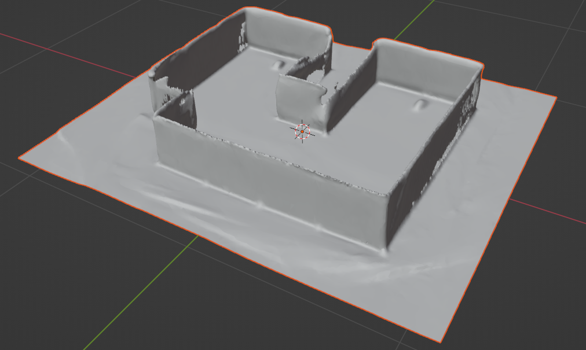
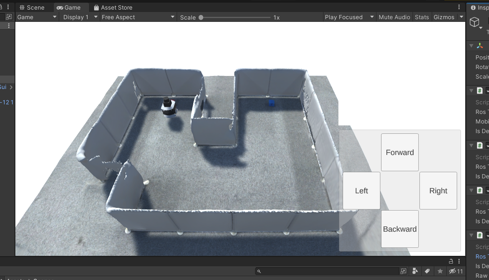
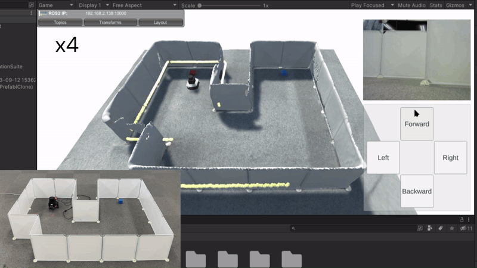

# スキャンした3Dモデルの表示

## 概要

スマートフォンを用いてスキャンした部屋の3Dモデルを、Unity上で表示する方法を紹介します。

本ステップ実行後の状態のSceneファイルは[`MobileRobotUITutorialProject/Assets/Scenes/Step8.unity`](../MobileRobotUITutorialProject/Assets/Scenes/Step8.unity)から入手できます。

## 動作確認済環境

* Windows
  * Windows 10 Home バージョン 21H2
  * Windows 11 Pro バージョン 22H2
* Unity
  * Unity 2021.3.4f1
  * Unity 2022.3.8f1
* [Unity-Technologies/ROS-TCP-Connector](https://github.com/Unity-Technologies/ROS-TCP-Connector) v0.7.0
* ROS 2
  * ROS 2 Foxy Fitzroy
  * ROS 2 Humble Hawksbill
* iPhone 12 Pro
* Scaniverse

## 手順

### 1. 部屋の3Dモデルの準備

部屋の3Dモデルを用意します。
本教材では、例としてiOS向けの3Dスキャンアプリ「Scaniverse」を使用して部屋のスキャンを行い、3Dモデルを作成します。
Unityでインポートできるファイル形式の3Dモデルを出力できるなら他のアプリでも問題ありません。

まず、3Dスキャンアプリをスマートフォン（本教材ではiPhone 12 Pro）にインストールします。
アプリの指示に従って部屋をスキャンし、Unityがインポートできるファイル形式（FBX形式など）で3Dモデルを出力してください。

以上で部屋の3Dモデルの準備が完了しました。

### 2. 3Dモデルの表示

スキャンした部屋の3DモデルをUnityにインポートします。

まず、`Assets/Models`フォルダ内に、作成した3Dモデルのファイルをドラッグアンドドロップします。
インポート自体はこれだけで完了です。

次に、3Dモデルを表示してみましょう。
`Assets/Models`フォルダ内の3DモデルをHierarchyへドラッグアンドドロップします。
3Dモデルが表示されていれば成功です。
部屋の位置や姿勢を調整したい場合は、表示している3Dモデルを選択してInspectorの`Transform`の`Position`や`Rotation`の値を変更してください。

3DモデルがFBX形式の場合、インポート時にテクスチャが設定されず、3Dモデル全体が真っ白になってしまうことがあります。
適切にテクスチャを設定するためには`Assets/Models`フォルダにある3Dモデルをクリックして、
Inspectorの`Materials`タブにある`Location`を`Use External Materials（Legacy）`に変更する必要があります。
そして、`Apply`ボタンを押すことでテクスチャの設定が反映されるはずです。

以上で、3Dモデルを表示させることができました。

### 3. Unityプロジェクトの実行

[STEP2](./step2.md)と同様に、

1. 再生モードでUnityプロジェクトを実行
2. Raspberry Pi Mouseでコマンドを実行
3. 操作ボタンから移動指令送信

の手順でロボットを動かしてみます。

スキャンした部屋の3Dモデル上で、Raspberry Pi Mouseを走行させることができました。

最後に、動作確認が終わったら全ての端末でCtrl+Cを押してコマンドを終了させます。

## 本STEPのまとめ

スマートフォンでスキャンした部屋の3DモデルをUnity上に表示しました。

---

* [目次](./intro2.md)
* < [STEP7](./step7.md)
* \> [STEP9](./step9.md)