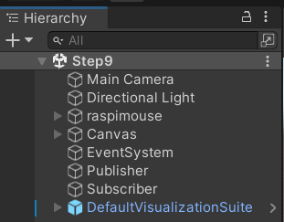
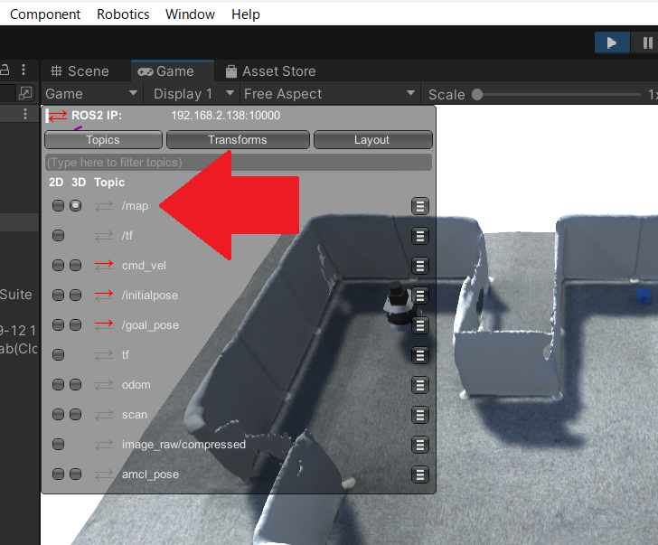
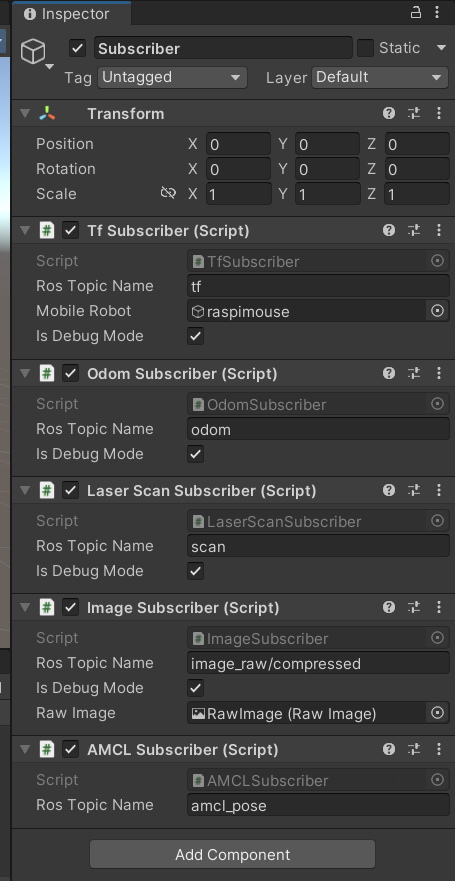
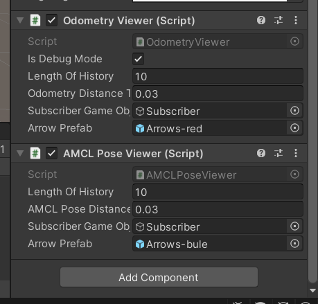
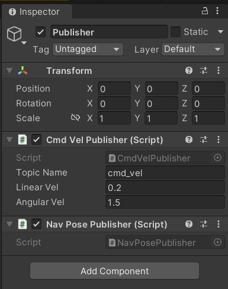
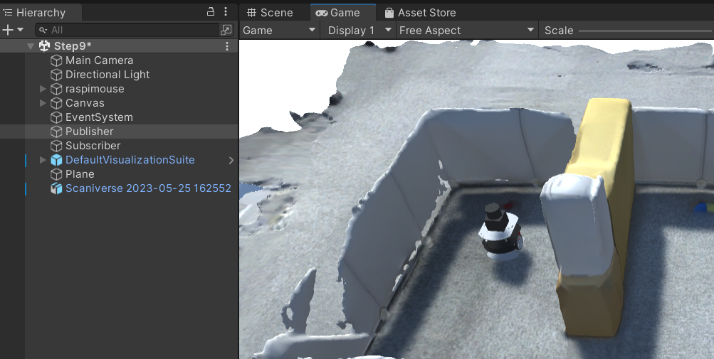
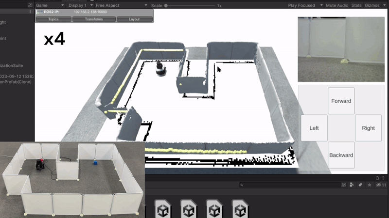
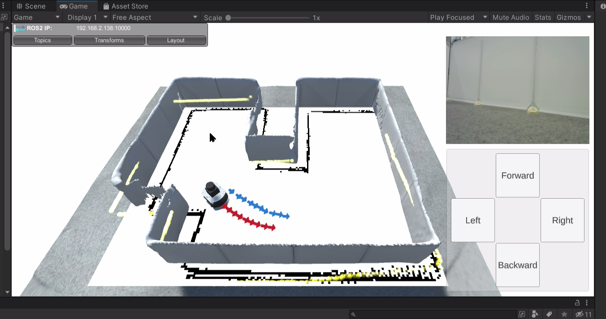

# SLAMによる地図生成とナビゲーション

## 概要

SLAMによる地図生成と、指定した目的位置まで自動で走行するナビゲーションについて紹介します。

デモでは実際に地図を作成し、クリックした地点までロボットを走行させます。

本ステップ実行後の状態のSceneファイルは[`MobileRobotUITutorialProject/Assets/Scenes/Step9.unity`](../MobileRobotUITutorialProject/Assets/Scenes/Step9.unity)から入手できます。

## 動作確認済環境

* Windows
  * Windows 10 Home バージョン 21H2
  * Windows 11 Pro バージョン 22H2
* Unity
  * Unity 2021.3.4f1
  * Unity 2022.3.8f1
* [Unity-Technologies/ROS-TCP-Connector](https://github.com/Unity-Technologies/ROS-TCP-Connector) v0.7.0
* ROS 2
  * ROS 2 Foxy Fitzroy
  * ROS 2 Humble Hawksbill

## 手順

[STEP7](./step7.md)でJoystickを作成しましたが、ロボットの操作はボタンとJoystickのどちらでも問題ありません。

### 1. ROS 2パッケージのインストール

Raspberry Pi MouseにSLAMとナビゲーションを行うためのROS 2パッケージをインストールします。

`$ROS_DISTRO`の部分には`humble`か`foxy`が入ります。

```sh
cd ~/ros2_ws/src
git clone -b $ROS_DISTRO-devel https://github.com/rt-net/raspimouse2
git clone -b $ROS_DISTRO-devel https://github.com/rt-net/raspimouse_ros2_examples
git clone -b $ROS_DISTRO-devel https://github.com/rt-net/raspimouse_description
git clone -b $ROS_DISTRO-devel https://github.com/rt-net/raspimouse_slam_navigation_ros2
rosdep install -r -y -i --from-paths . --ignore-src
cd ~/ros2_ws
colcon build --symlink-install
source ~/ros2_ws/install/setup.bash
```

以上で必要なROS 2パッケージのインストールは完了です。

### 2. Visualizations Packageのインストール

ROS 2上のデータを可視化するため、Unityプロジェクトに`Visualizations Package`をインストールします。

まず、`Window` -> `Package Manager`でパッケージマネージャーを開きます。
そして、`Add package from git URL`を選択し、下記のURLを入力、最後にAddボタンを押します。

```
https://github.com/Unity-Technologies/ROS-TCP-Connector.git?path=/com.unity.robotics.visualizations
```

インストールできたら、`Packages/Unity Robotics Visualization`の中にある`DefaultVisualizationSuite`をHierarchyにドラッグ&ドロップします。



以上で`Visualizations Package`のインストールは完了です。

### 3. 地図生成

それでは、SLAMによる地図生成を行います。

Unityで再生ボタンを押し、再生モードでプロジェクトを実行します。

* 注意 : mapトピックを適切に可視化するために、Raspberry Pi Mouseでコマンドを実行するよりも先にUnityプロジェクトを実行する必要があります

さらに、Raspberry Pi Mouseを起動してください。

デバイスドライバのインストールをまだ行っていない場合、
以下のコマンドを実行してインストールを行ってください。

```sh
cd RaspberryPiMouse/utils
./build_install.bash
```

一つ目の端末で以下のコマンドを実行し、SLAMを行うために必要なノードを起動します。

```sh
ros2 launch raspimouse_slam robot_bringup.launch.py lidar:=rplidar
```

二つ目の端末で以下のコマンドを実行し、SLAMのノードを起動します。

```sh
ros2 launch raspimouse_slam pc_slam.launch.py
```

三つ目の端末で以下のコマンドを実行し、Unityと通信するためのノードを起動します。
`ROS_IP`はRaspberry Pi MouseのIPアドレスを指定してください。

```sh
ros2 run ros_tcp_endpoint default_server_endpoint --ros-args -p ROS_IP:=192.168.1.89
```


Unityのゲーム画面の左上にVisualizations Packageのパネルが表示されているので、
mapトピックの3Dにチェックを入れて地図情報を可視化します（mapトピックの項目が見つからない場合はそのまま進めてください）。



UnityからRaspberry Pi Mouseを操作して、部屋の中を隈なく走行させます。
このとき、地図がどのように生成されているかは、mapトピックを可視化することで確認できます。

十分に地図が生成できたら、四つ目の端末を開き、以下のコマンドで地図データを保存します。
`MAP_NAME`は任意の文字列を指定できます。

```sh
ros2 run nav2_map_server map_saver_cli -f ~/MAP_NAME
```

以上でSLAMによる地図生成は完了です。

地図が作成できたら全ての端末でCtrl+Cを押してコマンドを終了させます。

### 4. amcl_poseトピックの可視化

これまではodomトピック（赤色の矢印）を可視化していましたが、
それに加えてamcl_poseトピック（青色の矢印）も可視化します。
`amcl`とはLiDARやオドメトリの情報を用いてロボットの位置姿勢を推定する手法のことです。
推定した位置姿勢がamcl_poseトピックに配信されます。

まず、amcl_poseトピックを受信するためのサブスクライバを設定します。
Hierarchyにある`Subscriber`オブジェクトに、`Assets/Scripts/amclSubscriber.cs`スクリプトをアタッチします。



次に、amcl_poseトピックを可視化するための設定を行います。
Hierarchyにある`raspimouse`オブジェクトに、`Assets/OdometyViewer/Scripts/amclPoseViewer.cs`スクリプトをアタッチします。
さらに、`amcl Pose Viewer`コンポーネントの`Subscriber Game Object`に`Subsciber`オブジェクトを、
`Arrow Prefab`に`Assets/OdometryViewer/Prefabs/Arrows-blue.prefab`を指定します。



以上でamcl_poseトピックを可視化する準備は完了です。

### 5. goal_poseトピックの配信設定

Unity側からgoal_poseトピックを配信できるように設定します。
goal_poseとはナビゲーションにおける目標地点のことです。
このgoal_poseを目指してRaspberry Pi Mouseが走行します。

まず、Hierarchyにある`Publisher`オブジェクトに、`Assets/Scripts/navPosePublisher.cs`スクリプトをアタッチします。



次に、Hierarchy上で右クリックし、`3D Object` -> `Plane`を選択して、`Plane`オブジェクトを生成します。
ここで生成した`Plane`オブジェクトは、地面と平行になるように、かつ、位置関係が部屋の3Dモデルの少しだけ下になるように設置してください。



以上でgoal_poseトピックの配信の設定は完了です。

### 7. ナビゲーション

SLAMで生成した地図データを元に、Raspberry Pi Mouseを自動で走行させるナビゲーションを行います。

Unityで再生ボタンを押し、再生モードでプロジェクトを実行します。

* 注意 : mapトピックを適切に可視化するために、Raspberry Pi Mouseでコマンドを実行するよりも先にUnityプロジェクトを実行する必要があります

一つ目の端末で以下のコマンドを実行し、ナビゲーションに必要なノードを起動します。

```sh
ros2 launch raspimouse_navigation robot_navigation.launch.py lidar:=rplidar
```

二つ目の端末で以下のコマンドを実行し、ナビゲーションのノードを起動します。
`map`はSLAMで生成した地図データのパスを指定してください。

```sh
ros2 launch raspimouse_navigation pc_navigation.launch.py map:=./MAP_NAME.yaml
```

注意 : 下記のエラーが出る場合、地図データのパスが間違っている可能性があります

```
[component_container_isolated-1] [INFO] [1695877177.802141764] [global_costmap.global_costmap]: Timed out waiting for transform from base_link to map to become available, tf error: Invalid frame ID "map" passed to canTransform argument target_frame - frame does not exist
```

三つ目の端末で以下のコマンドを実行し、Unityと通信するためのノードを起動します。
`ROS_IP`はRaspberry Pi MouseのIPアドレスを指定してください。

```sh
ros2 run ros_tcp_endpoint default_server_endpoint --ros-args -p ROS_IP:=192.168.1.89
```

Unityのゲーム画面においてマウスで目標地点をクリックするとgoal_poseトピックが配信されます。
そして、Raspberry Pi Mouseがその目標地点を目指して自動で走行します。
カメラの角度によっては、クリック地点にずれが発生する場合があります。
その場合はカメラの位置姿勢を、地図の真上から見下ろすように変更することで対処できます。



最後に、ナビゲーションの動作確認が終わったら全ての端末でCtrl+Cを押してコマンドを終了させます。

## 実際のロボットとUnity上のロボットの位置姿勢のずれ

ロボットの走行中に、実際のロボット（青い矢印の軌道）とUnity上のロボット（赤い矢印の軌道）を見比べると、位置姿勢にずれが発生していることが分かります。
このずれは、Unity上のロボットが誤差を考慮していないために発生していると考えられます。



Unity上のロボットはオドメトリという手法で求めた位置姿勢データを元に動いています。
このオドメトリは、車輪のスリップや段差への乗り上げなどの様々な要因で発生する誤差を考慮していません。
そのため、オドメトリだけでは正確に位置姿勢を計算できず、実際のロボットに対してずれが発生します。
これが実際のロボットとUnity上のロボットの位置姿勢のずれの原因だと考えられます。

ちなみに、Unity上の青い矢印は、`AMCL`という手法で推定した位置姿勢を表しています。
`AMCL`はLiDARのデータと既知の地図情報、オドメトリのデータを組み合わせて自己位置推定を行います。
オドメトリだけでは走行中に発生する誤差に対応できませんが、他のセンサデータと組み合わせることで対応が可能になる場合があります。

## 本STEPのまとめ

SLAMによる地図生成とナビゲーションを行う方法を紹介しました。

# 終わりに

「UnityとROS 2で学ぶ移動ロボット入門 UI作成編」のチュートリアルは以上です。
本教材の内容を応用したオリジナル作品の作成や、
各種ツールのより高度なテクニックを学ぶ際は[INTRO1](./intro1.md)、
[INTRO2](./intro2.md)にてご紹介したリンク先をぜひ参考にしてみてください。

これから先、Raspberry Pi Mouse以外のロボットを試してみたり、Unity Asset Storeなどで公開されているアセットを組み合わせてカスタマイズしてオリジナルUIにチャレンジしたり、
みなさんがROS 2対応移動ロボットとUnityを組み合わせてUIを制作する際の一助となれば幸いです。

---

* [目次](./intro2.md)
* < [STEP8](./step8.md)